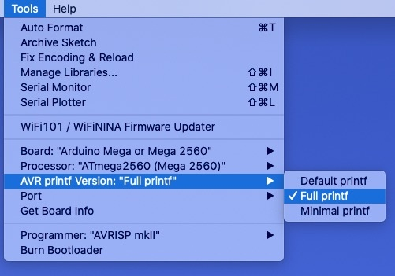

## Software Installation

The following steps are required to install the TankController software.

1. _Install the [Arduino Desktop IDE](https://www.arduino.cc/en/software)._
    1. Download and unzip the appropriate executable for your platform (Linux, macOS, or Windows; on Windows use the zip file rather than the Windows Store option so that you can edit the config in step 2).
    2. Copy the directory or package to an appropriate place for applications on your platform.
    3. Follow the [Getting Started Guide](https://www.arduino.cc/en/Guide/ArduinoMega2560) to confirm that you can install and run the "Blink" software.

&nbsp;  

2. _Configure the IDE._ By default, the Arduino compiler links to a `printf()` library that does not support printing floating point numbers (for details see [here](https://forum.arduino.cc/t/no-sprintf-float-formatting-come-back-five-year/331790/6)). To get that feature do the following:
    1. Locate the `boards.txt` file. This file is in the downloaded at `arduino-1.8.15/hardware/arduino/avr/boards.txt` (on macOS look in `~/Library/Arduino15/packages/arduino/hardware/avr/1.8.3`).
    2. Open `boards.txt` in a text editor and look for a `mega.menu` label.
    3. After the existing menu definitions, add the following and save the file:

```text
## Arduino Mega printf() library options
## -------------------------
menu.printf=AVR printf Version

mega.menu.printf.default=Default printf
mega.menu.printf.default.compiler.c.elf.extra_flags=
mega.menu.printf.full=Full printf
mega.menu.printf.full.compiler.c.elf.extra_flags=-Wl,-u,vfprintf -lprintf_flt
mega.menu.printf.minimal=Minimal printf
mega.menu.printf.minimal.compiler.c.elf.extra_flags=-Wl,-u,vfprintf -lprintf_min
```

3. Launch the Arduino Desktop IDE and use the Tools menu to select `ARV printf Version: "Full printf"`:



### TankController software

4. _Download TankController._
    1. Download the [TankController](https://github.com/Open-Acidification/TankController) software by cloning the code using Git or downloading a [zip](https://github.com/Open-Acidification/TankController/releases) of the code and unzipping it.
    2. Copy the TankController directory to `Documents/Arduino/libraries` (or other location where you have your Arduino applications and examples).

&nbsp;  

5. _Install TankController._
    1. In the Arduino Desktop IDE, open `TankController/examples/TankController.ino`.
    2. If you have a PushingBox Identifier, add it where indicated (line 7).
    3. Click the "Upload" button (a right-facing arrow) or select the "Sketch / Upload" menu.
    4. If you do not have an Ethernet cable attached you can shorten the startup time by pressing any key to skip the DHCP request; release the key when you see the idle screen (with current values and targets for pH and temperature).

## Software Configuration

### Menus

Because of the limitations of our input and output devices (a 4x4 keypad and a 16x2 LCD), the user interface is designed to be relatively simple. The initial (or _idle_) screen shows the current values and targets for pH and temperature. From this screen you can select a menu to view settings or a menu to change settings.

#### Top-level Menu

The idle screen is the first of three top-level screens:

* Idle
* View Settings
* Change Settings

These three screens are connected as a loop where the '2' key goes up and the '8' key goes down. So pressing '8' (down) from the idle screen will take you to the View Settings screen with the following display:

```text
View settings
<4   ^2  v8   6>
```

Note the "^2" for "up" and the "v8" for "down". This is a reminder of how to go up and down through the top-level menu screens. From here, pressing '2' will go "up" to the idle screen and pressing '8' will take you "down" to the Change Settings screen with the following display:

```text
Change settings
<4   ^2  v8   6>
```

From here pressing '2' will go "up" to the View Settings screen and pressing '8' will take you "down" and loop back to the top to show the idle screen.

#### View Settings Menu

When on a menu option you can select it by pressing '6' (right). In the case of the "View settings" menu, you will be taken to a new sequence of menus:

* View time
* View PID
* View pH slope
* View tank ID
* View log file
* View Google mins
* View IP and MAC
* View version
* View free memory

As with the top-level menu, you can move down (8) and up (2) and you can select an item (6).
In addition, you can return to the top-level menu by pressing '4' (left).
Selecting a menu item (6>) will take you to the state where you are viewing the requested information.
In most cases you can exit from this state by pressing any key.
If you don't press a key then after a minute the device returns to the idle screen.

#### Change Settings Menu

You can select the Change Settings menu by pressing '6' (right) and be taken to a new set of menu options:

* Set pH target
* Set temperature
* pH calibration
* Clear pH calibration
* Temp calibration
* Set KP
* Set KI
* Set KD
* PID on/off
* Set chill/heat
* Set Google mins
* Set date/time
* Set Tank ID

As before, you can move up (2), down (8), left (4), and right (6).
